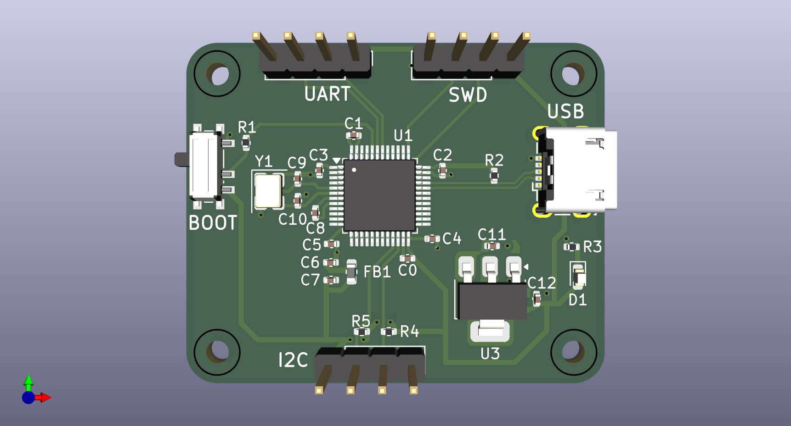

# STM32_BluePill_Pcb
A custom STM32F103C8T6 development board designed in KiCad

 

⚠️ Disclaimer: First PCB Project
**Please note:** This is my very first custom PCB design! I reverse-engineered the popular "Blue Pill" board to design this custom circuit in KiCad. It was created as a personal learning exercise to understand the bridge between embedded software and physical hardware. While I put a lot of effort into following best practices, there may be errors. **This project should not be used as an official hardware reference.**

## 🛠️ Project Overview
This repository contains the KiCad project files for a custom microcontroller development board based on the **STM32F103C8T6** (ARM Cortex-M3). 

### Hardware Specifications & Features:
* **PCB Stackup:** Routed on a standard 2-layer board.
* **Connectivity & Debugging:** Includes a dedicated **SWD (Serial Wire Debug)** header for easy flashing/debugging, plus broken-out **UART** and **I2C** pins for external sensor communication.
* **USB Interface:** Integrated Micro-USB Type-B connector for power and data.
* **Clocking:** External crystal oscillator circuit included for precise timing and USB synchronization.
* **User Interface:** Includes a dedicated BOOT button for flashing/configuration and a Power indicator LED.
* **Signal Integrity:** Robust power routing with separated digital and analog ground planes (where applicable).

## ⚡ Technical Deep Dive: Decoupling Capacitors
One of the primary focuses of this project was understanding and implementing proper power delivery. Because microcontrollers switch states millions of times per second, they require instantaneous bursts of current. Traces and power supplies have inherent inductance and cannot deliver this current fast enough, potentially causing the system to crash. 

To ensure stability, I implemented a strict decoupling strategy:
* **Local Decoupling (100nF):** Placed as close as physically possible to each `VDD` and `VBAT` pin. These act as tiny, instant energy reservoirs to handle high-frequency switching.
* **Bulk Decoupling (10uF):** Placed near the microcontroller to act as a larger, general energy reservoir for the IC.
* **Analog Filtering (VDDA):** The analog supply pin is highly sensitive to digital noise. I isolated it from the main digital 3.3V rail using a ferrite bead (120Ω at 100MHz) flanked by a 1uF and 10nF parallel capacitor network to protect the internal Analog-to-Digital Converters (ADCs).

## 📂 Files Included
* Core KiCad project files (`.kicad_pro`, `.kicad_sch`, `.kicad_pcb`).
* `Schematic.pdf`: Exported PDF of the logical circuit map.

---
*Designed by Drias Imad Eddine *
